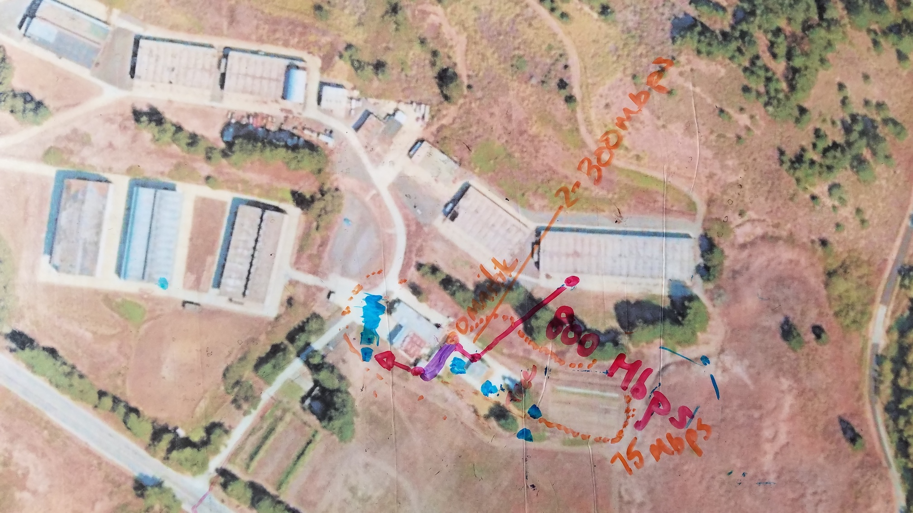
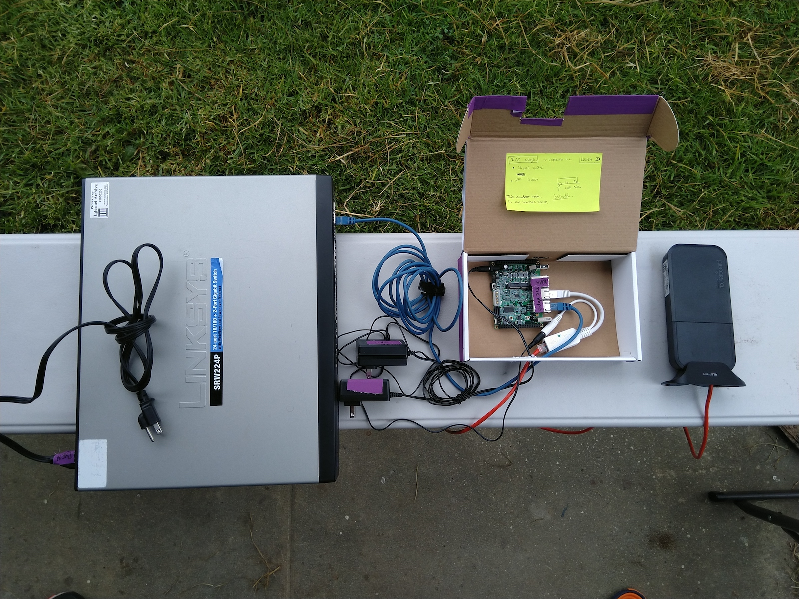
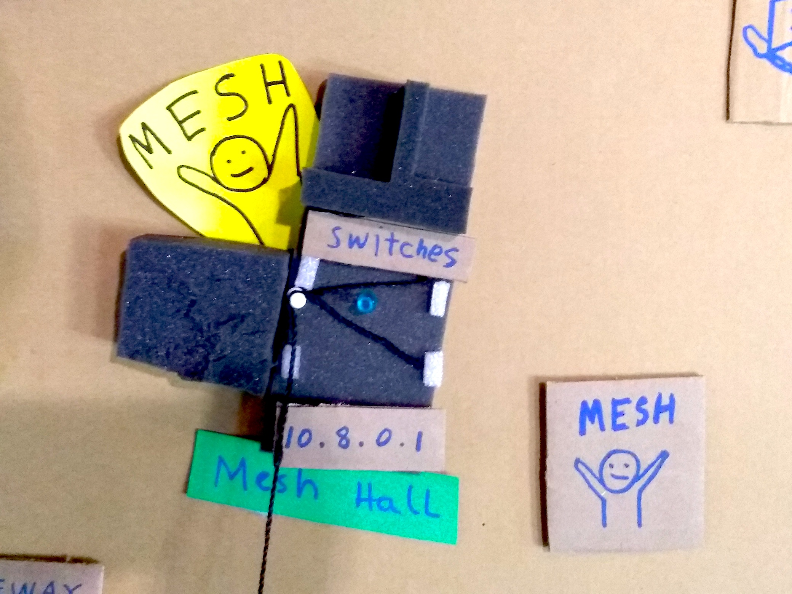

## 2.0 Network Design

The DWeb Camp 2019 mesh network is designed as an experimental network that prioritizes flexibility and modularity over reliability.

### Hardware Components

The central router of each node is an ESPRESSObin single-board computer (SBC). If you are unfamiliar with SBCs, think your smart phone, but instead of having a screen and a camera it now has gigabit network ports. These relatively low-cost but powerful boards (lots of RAM and CPU cycles) are usually used for tinkering rather than running production networks, which means we have wandered pretty far off from "reliable networking equipment", in exchange for great flexibility, to perhaps one day play with resource intensive routing protocols or host dockerized peer-to-peer services right on our routers.

Another important feature is modularity, which allows us to easily construct different mesh nodes according to the network topology. For example, switching a pair of MikroTik Wireless Wire for an ethernet cable requires no software configuration, neither does switching between different types of Access Points or Network Switches. We also discovered an unanticipated consequence of having modular devices; it allowed us to hold a device and describe its single purpose in a mesh node, allowing new network participants to visualize the different components necessary to form a mesh node and build a mental picture of a network exchanging information over different wireless frequencies across the venue. This ability to teach many aspects of the network allowed us to recruit and form small teams of [Network Stewards](3.2-network-stewards.html) that go around the site rapidly extending, altering, and repairing the network, while on-boarding new participants in the process.

The diagram below illustrates how the router in **Node 1** uses two `lan` ports connect its Local Area Network (LAN) and one `wan` port to connect a mesh radio to access the Wide Area Network (WAN). In this example, Camp participants would connect their wireless devices (e.g. phones and laptops) to an Access Point attached to `lan0` and wired devices (e.g. Raspberry Pi and servers) to a Network Switch attached to `lan1`. In another node, both `lan` ports can each be attached to an Access Point in order to cover a large hall, for example, and no software changes would be necessary as explained above.

Since we only have one `wan` port, in cases where we use more than one mesh radio (i.e. not an edge node), we connect a VLAN-tagging switch to the `wan` port and then the mesh radios to the switch ports. This way, the router sees `wan.1`, `wan.2`, ..., `wan.N` network interfaces, for `N` mesh radios connected, and Babel can route traffic between them based on the dynamic network topology and route metrics. The above diagram shows an example edge node, **Node 1**, that is connected to a relay node, **Node 2**, that utilizes a VLAN-tagging switch to connect three mesh radios.

We ended up deploying 6 nodes throughout Camp, and then a 7th node as an activity. All our nodes have different components and some of them evolved throughout the days of Camp. You can see a [list of hardware](5.2-hardware-inventory.html) that make up these mesh nodes. Participants have no expectation of roaming across different building zones, and they can check their IP address to see exactly which node they are connected to.

### IP Assignments

The network assigns each connected device an IP address from the `10.X.0.0/16` subnet that is unique across Camp, where `X` corresponds to the building number on the physical map. For example, the `Mesh Hall` node has IP address `10.8.0.1` and assigns from `10.8.0.0/16` because its building number is `8`.

The lack of Network Address Translation (NAT) allows for any device to work as a server, having a stable IP address that other devices can reach. This eliminates the need for intermediary nodes with public IP addresses, making it easy for peer-to-peer protocols to bootstrap with anyone during Camp.

When a device moves from one building to another, and it decides to associate with another mesh node's Access Point, it will be assigned a new IP address meanwhile the last two octets will generally be the same as before. If one is running a server, this will change its IP address, so most service-hosting devices are connected via ethernet cable at a fixed building.

### Credits

This network is designed with contributions by members of [Toronto Mesh](https://tomesh.net), [People's Open](https://peoplesopen.net), and [Althea](https://althea.org), and draws from MikroTik radio documentations published by [NYC Mesh](https://nycmesh.net).
