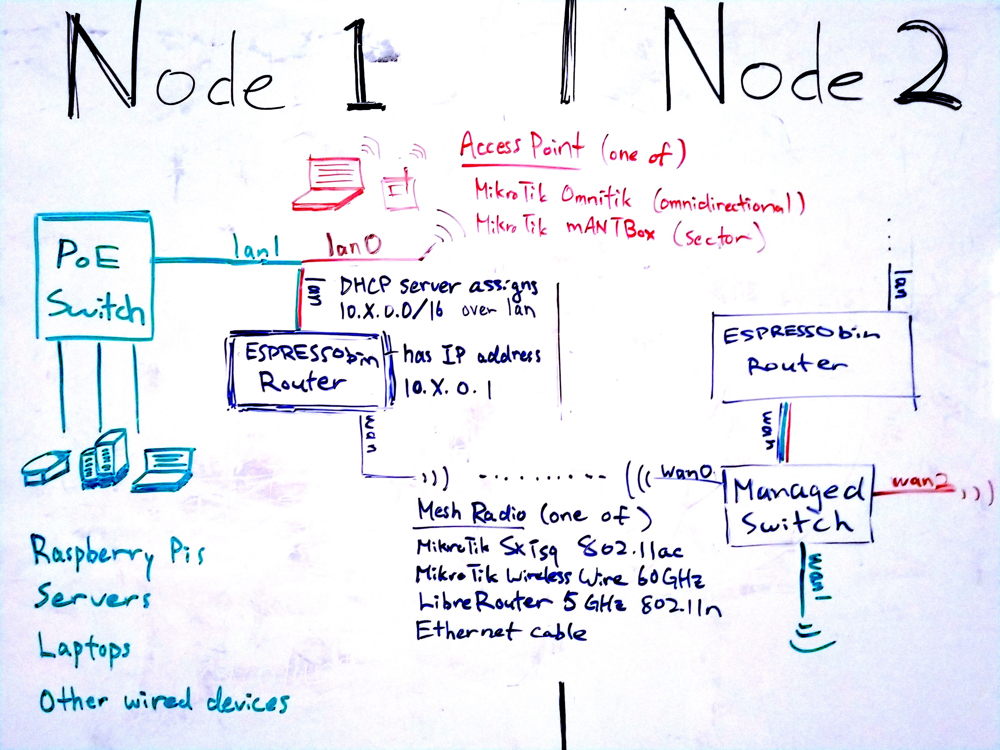

## 2.0 Network Design

 

TODO

### Credits

This network is designed with contributions by members of [Toronto Mesh](https://tomesh.net), [People's Open](https://peoplesopen.net), and [Althea](https://althea.org), and draws from MikroTik radio documentations published by [NYC Mesh](https://nycmesh.net).
