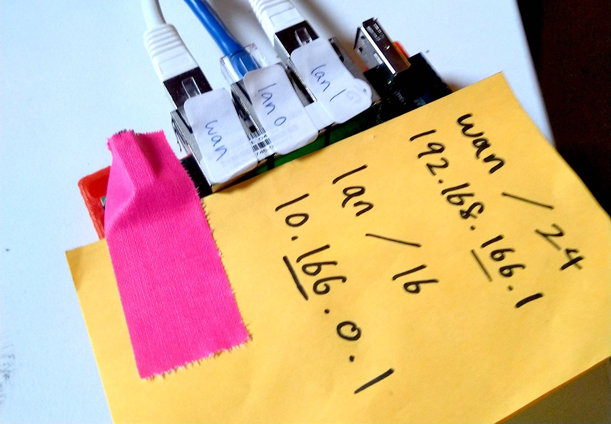

## 2.1 ESPRESSObin Router

The router is responsible for three things:

1. Distribute IP addresses to wired and wireless client devices on the LAN
1. Distribute routes to its LAN across the mesh network using Babel
1. Route IP packets across the mesh network using Babel

It is the central point of each node where all other devices are connected to.



### ESPRESSObin SBUD102 V5

We will configure the ESPRESSObin board so `wan` is used to connect point-to-point mesh radios, and `lan0` and `lan1` are bridged as `lan` for the local wired and wireless network:

```
    +-ESPRESSOBIN---------+P+-+
    |                      O  |
    |                      W  |
    |                      E  |
    |      L     L     W   R  |
    |      A     A     A      |
    |    +-N-+ +-N-+ +-N-+    |
    +----| 1 |-| 0 |-|   |----+
         +---+ +---+ +---+
```

1. Flash SD card with [Armbian for ESPRESSObin](https://www.armbian.com/espressobin/), then insert it into the ESPRESSObin with Internet access through one of its ethernet ports, then power on (never connect two ESPRESSObin devices to the same network until after you run this install script, the ethernet interface on all devices have the same MAC address and it will packet storm your network, nobody wants that)

1. [Connect via serial interface](http://wiki.espressobin.net/tiki-index.php?page=Serial+connection+-+Linux) to the ESPRESSObin's micro-USB port and run something like `minicom` on your computer to update the boot script (you probably need to paste a few lines at a time and make sure there are no spaces before and after each line):

    ```
    env default -a
    setenv fdt_addr 0x6000000
    setenv kernel_addr 0x7000000
    setenv loadaddr 0x8000000
    setenv initrd_size 0x2000000
    setenv initrd_addr 0x1100000
    setenv scriptaddr 0x6d00000
    setenv initrd_image uInitrd
    setenv boot_targets 'usb sata mmc1 mmc0'
    setenv boot_prefixes '/ /boot/'
    setenv bootcmd_mmc0 'setenv devnum 0; setenv boot_interface mmc; run scan_dev_for_boot;'
    setenv bootcmd_mmc1 'setenv devnum 1; setenv boot_interface mmc; run scan_dev_for_boot;'
    setenv bootcmd_sata 'setenv devnum 0; scsi scan; scsi dev 0; setenv boot_interface scsi; run scan_dev_for_boot;'
    setenv bootcmd_usb 'setenv devnum 0; usb start;setenv boot_interface usb; run scan_dev_for_boot;'
    setenv bootcmd 'for target in ${boot_targets}; do run bootcmd_${target}; done'
    setenv scan_dev_for_boot 'for prefix in ${boot_prefixes}; do echo ${prefix};run boot_a_script; done'
    setenv boot_a_script 'ext4load ${boot_interface} ${devnum}:1 ${scriptaddr} ${prefix}boot.scr;source ${scriptaddr};'
    saveenv
    ```
    
    then run `boot` to boot into the SD card

1. Login as `root` / `1234` then run [espressobin/install](https://github.com/dweb-camp-2019/meshnet/blob/master/prodnet/espressobin/install) and go through the first-run menus.

1. Figure out what type of node this will be:

    | Type    | Description                                                                        |
    |:--------|:-----------------------------------------------------------------------------------|
    |`edge`   | Node with only one _Point-to-point Mesh Radio_                                     |
    |`relay`  | Node with multiple _Point-to-point Mesh Radios_ and relays traffic for other nodes |
    |`gateway`| Node that routes the local network to the Internet                                 |
 
    then run with a `TYPE` from above and a `NODE_ID` between 0 to 99:

    ```
    # wget https://raw.githubusercontent.com/dweb-camp-2019/meshnet/master/prodnet/espressobin/install
    # chmod +x install
    # ./install TYPE NODE_ID
    ```

_The ESPRESSObin V5 has been discontinued and became unavailable weeks before DWeb Camp 2019. The ESPRESSObin V7 can be used in place of the V5._