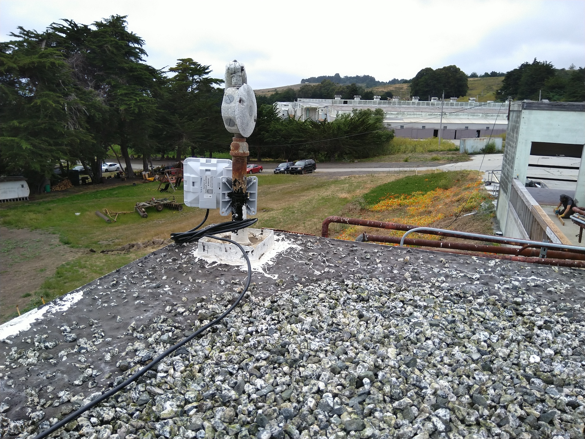

## 2.3 Point-to-Point Mesh Radios

Directional radios that make a point-to-point link are put into bridge mode to serve as a wireless replacement of an ethernet cable. These high gain radios need to be aligned carefully to be pointed at one another within about 20 degrees to get optimal speeds.

### MikroTik SXTsq 5 ac (5 GHz)

1. Download the latest release of [RouterOS for the SXTsq 5 ac](https://mikrotik.com/product/sxtsq_5_ac) (`v6.44.3 (stable)` is the version used)

1. Connect your computer to the ethernet port of the MikroTik device and configure the static IP `192.168.88.100` on the local network interface

1. Connect to `192.168.88.1` and login to the web interface as `admin` without password, upload the `.npk` file and reboot the device, then verify RouterOS is upgraded to the latest

1. SSH into the device with `ssh admin@192.168.88.1`

1. Ensure the device has fresh configurations, run `/system reset-configuration` if needed

1. Run [sxtsq/sxtsq-ap.rsc](https://github.com/dweb-camp-2019/meshnet/blob/master/prodnet/sxtsq/sxtsq-ap.rsc)

1. Reboot the device with `/system reboot` and it will acquire the new IP address `192.168.88.2`

1. Repeat the above steps for the second (client) device, then run [sxtsq/sxtsq-client.rsc](https://github.com/dweb-camp-2019/meshnet/blob/master/prodnet/sxtsq/sxtsq-client.rsc), and it will acquire the new IP address `192.168.88.3` after reboot

### MikroTik Wireless Wire (60 GHz)

These are pre-configured devices that operate at 60 GHz to form a gigabit wireless link at distances ~100 m. They send and receive between 700-900 Mbps even when alignment is a little off and have LEDs to indicate link quality. The pair has management IP addresses of `192.168.88.2` and `192.168.88.3`, when can be accessed via the ESPRESSObin via SSH as `admin` user, but this usually isn't necessary as they should "just work" as if it is an actual ethernet cable.

### Ethernet Cable

If distances allow, you can just use an ethernet cable to link two nodes. Remember the maximum distance for ethernet cables to work reliably is 100 m. Make sure to use reliable cables, as a lot of issues have been due to faulty cables of unknown origin or poorly crimped connectors. These issues are often not picked up by ethernet cable testers.

