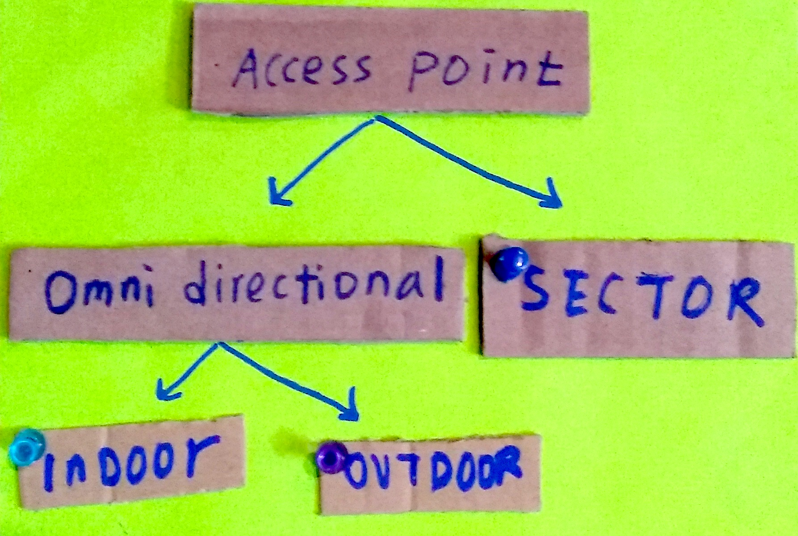

## 2.4 Access Point Radios

We use three models of radios depending on whether we need wireless coverage all around the antenna (omnidirectional) or an area within a 120 degree cone (sector). We will configure each radio to provide a 5 GHz-only network with:

```
SSID:     dwebcamp
Password: dwebcamp
```

There will be two users: `admin` with `ADMIN_PASSWORD`, and `me` with no password and read-only access to the access point web UI.



### MikroTik OmniTIK 5 PoE ac (Outdoor Omnidirectional)

1. Connect your computer to one of the LAN ethernet ports of the MikroTik device and configure the static IP `192.168.88.100` on the local network interface

1. SSH into the device with `ssh admin@192.168.88.1`

1. Ensure the device has fresh configurations, run `/system reset-configuration` if needed

1. Run [omnitik/omnitik-ap.rsc](https://github.com/dweb-camp-2019/meshnet/blob/master/prodnet/omnitik/omnitik-ap.rsc) after replacing the `ADMIN_PASSWORD`

### MikroTik mANTBox 15s (Outdoor Sector)

1. Connect the MikroTik device to a router with a DHCP server

1. Connect your computer to the router (not to the access point of the MikroTik device, otherwise configuration scripts will not fully execute whenever a command resets the access point)

1. Scan for the IP address of the MikroTik device with a tool like `nmap` or `arp-scan`

1. SSH into the device with `ssh admin@IP_ADDRESS`

1. Ensure the device has fresh configurations, run `/system reset-configuration` if needed

1. Run [mant15s/mant15s-ap.rsc](https://github.com/dweb-camp-2019/meshnet/blob/master/prodnet/mant15s/mant15s-ap.rsc) after replacing the `ADMIN_PASSWORD`

### MikroTik cAP ac (Indoor Dual-band Omnidirectional)

1. Connect the MikroTik device to a router with a DHCP server

1. Connect your computer to the router (not to the access point of the MikroTik device, otherwise configuration scripts will not fully execute whenever a command resets the access point)

1. Scan for the IP address of the MikroTik device with a tool like `nmap` or `arp-scan`

1. SSH into the device with `ssh admin@IP_ADDRESS`

1. Ensure the device has fresh configurations, run `/system reset-configuration` if needed

1. Run [cap/cap-ap.rsc](https://github.com/dweb-camp-2019/meshnet/blob/master/prodnet/cap/cap-ap.rsc) after replacing the `ADMIN_PASSWORD`

### MikroTik wAP ac 3x3 (Indoor Dual-band Omnidirectional)

1. Connect the MikroTik device to a router with a DHCP server

1. Connect your computer directly to the MikroTik device using WiFi at one of its two SSIDs

1. Scan for the IP address of the MikroTik device with a tool like `nmap` or `arp-scan`

1. SSH into the device with `ssh admin@IP_ADDRESS`

1. Run the commands in [wap/wap-ap.rsc](https://github.com/dweb-camp-2019/meshnet/blob/master/prodnet/wap/wap-ap.rsc) in stages:
    1. Run the first command after replacing the `ADMIN_PASSWORD`
    1. Run the next commands up to and including [Line 56](https://github.com/dweb-camp-2019/meshnet/blob/master/prodnet/wap/wap-ap.rsc#L56), this will change the WiFi password and break your WiFi and SSH connection
    1. Reconnect with the wAP using the new password on Line 56
    1. Run `nmap` again to get the device's new IP address
    1. SSH into the device again with it's new IP address `ssh admin@IP_ADDRESS`
    1. Run the next two blocks one by one, and reconnect as needed if the connection breaks
