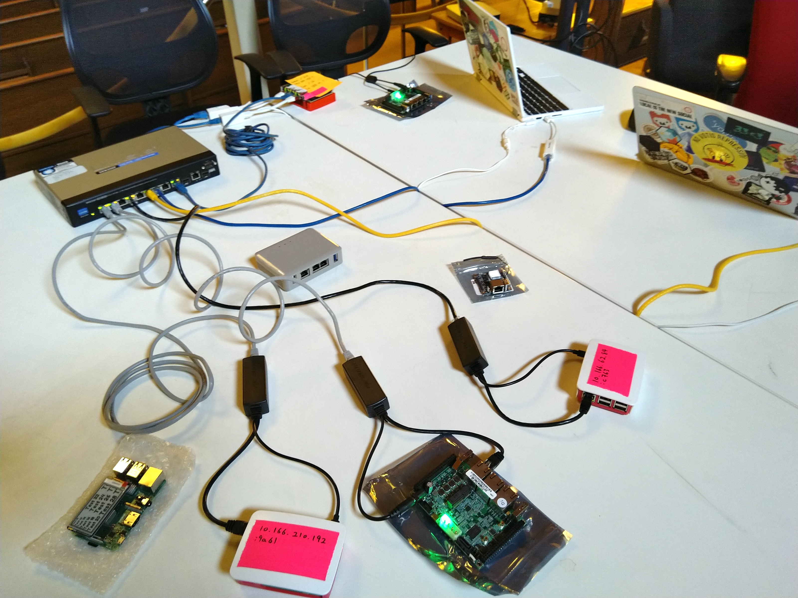

## 2.5 Client PoE Switches

Two models of Linksys PoE switches are used, SRW208P (8-port) and SRW224P (24-port), with 10/100 ports and two gigabit ports on each. 802.3af PoE splitters of 5V (micro-USB) and 12V (barrel-jack) are used to provide power and 10/100 networking to client devices, such as Raspberry Pis and laptops. They are on the same `10.X.0.0/24` LAN as client devices that are wirelessly connected through Access Points.