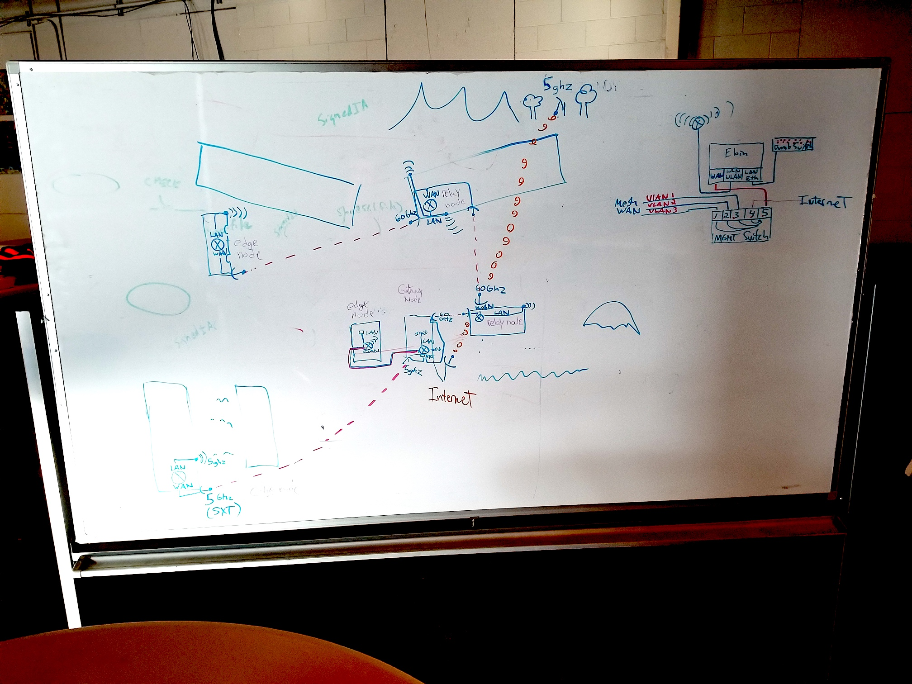
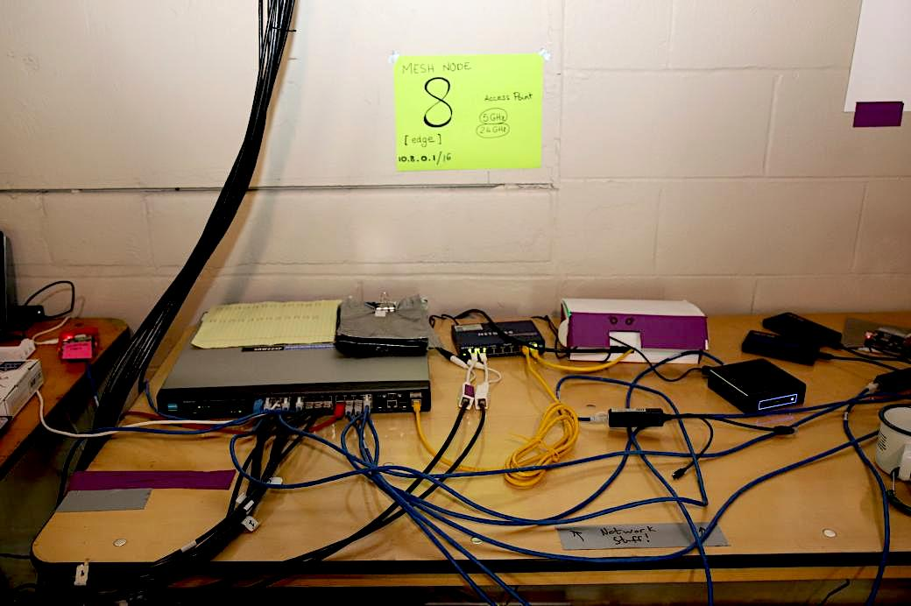
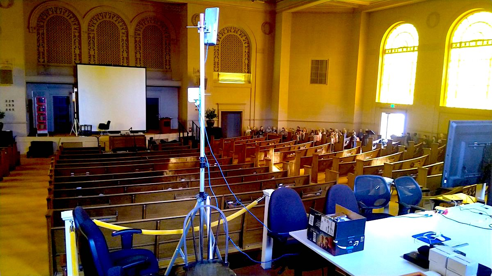
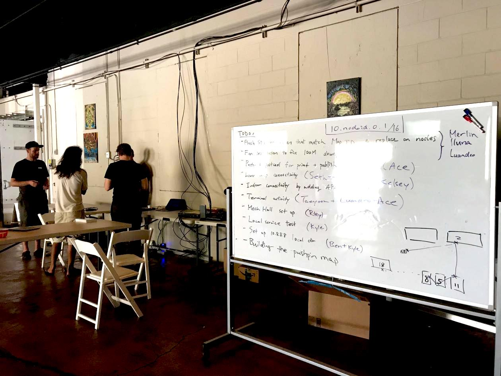
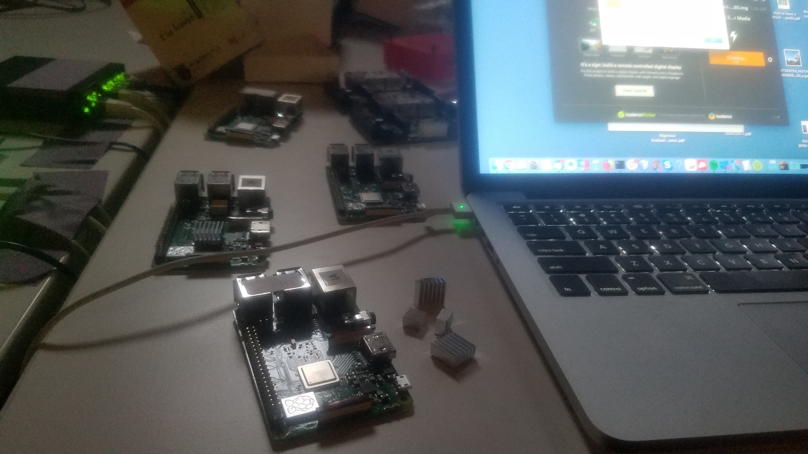

## 3.1 Collaborative Planning

There were two types of collaborations that took place throughout the network planning and deployment:

- _Virtual collaborations_ were usually asynchronous over discussions on [GitHub Issues](https://github.com/dweb-camp-2019/meshnet/issues?utf8=%E2%9C%93&q=is%3Aissue), plus a lot of real-time chat sessions on [#dweb-camp-2019-mesh:matrix.org](https://riot.im/app/#/room/#dweb-camp-2019-mesh:matrix.org) and [#tomesh:tomesh.net](https://riot.im/app/#/room/#tomesh:tomesh.net), where many volunteers excited about DWeb Camp contributed their expertise on networking hardware and software. Some of the contributors did not actually attend DWeb Camp, but their contributions were significant, especially during prototyping and design phases.

- _In-person collaborations_ happened over multiple trips to the venue and became the focus leading up and during the event, in addition to occasional gatherings at the Internet Archive. Having in-person work sessions proved to be important in engaging new people to take leadership on new initiatives and coordinating on-boarding activities.

### Planning The Meshnet

There were many moving pieces that only became clear weeks ahead of Camp:

- Available hardware budget and device availabilities
- Attendance and the coverage area of the event
- Volunteers' availability to help in different ways
- Availability of Internet access

Until July, the network existed as a 3-node mesh network running at the Internet Archive.

Before July, friends from [People's Open](https://peoplesopen.net) and [Althea](https://althea.net), along with other volunteers, have popped by the venue to conduct some radio testing, but we have never tested beyond a point-to-pint link on site.

The software that configures the mesh hardware, running on the Internet Archive demo system, has mostly been developed by Benedict with remote help from Yurko of [Toronto Mesh](https://tomesh.net). While the router and radio configurations borrow heavily from [Toronto Mesh's existing work on single-board computers](https://github.com/tomeshnet/prototype-cjdns-pi) and [NYC Mesh documentations](https://docs.nycmesh.net), the combination of these components into a modular system, as discussed in [Section 2](2.0-network-design.html), makes the overall network design and hence the software quite different from either. So at that time, only Benedict and Yurko knew how this system worked, and the volunteers from People's Open had an idea because they also use Babel in their network and has familiarity with how it works, so during earlier trips to the venue we were able to more or less stay in sync.

The risk in the few weeks leading up to Camp was whether we would discover significant problems when finally starting to deploy production nodes, and if so, do we have enough capacity to resolve the issues. In [Section 3.2](3.2-network-stewards.html), we will discuss how the Network Stewards program, that was [formally announced around mid-June](https://github.com/dweb-camp-2019/meshnet/issues/21) and consisting primarily of in-person high-bandwidth work sessions, proved to be key in the production network deployment and its continued maintenance.

### Prototyping Applications

Whether the physical network would work in production is one area of concern, but [around end of May](https://github.com/dweb-camp-2019/meshnet/issues/2#issuecomment-496729915), less than 2 months from Camp, the builders who intend to deploy their applications have started planning for their projects. Many of the uncertainty around how the applications may interface with this experimental network would need to be answered. These questions generally concern IP assignment, discovery protocols, [DNS](https://github.com/dweb-camp-2019/meshnet/issues/12), [SSL](https://github.com/dweb-camp-2019/meshnet/issues/11), [NTP](https://github.com/dweb-camp-2019/meshnet/issues/9), and hardware logistics.

In addition to answering questions on GitHub, two efforts were undertaken to help application builders get a better idea of the meshnet environment.

1. We arranged an [All Day Hackathon](https://www.eventbrite.com/e/all-day-hackathon-for-dweb-camp-tickets-63718679285) on June 26, about a month ahead of Camp, where builders who live nearby such as Mark who was building a [local communication app based on GUN running on Raspberry Pis](https://github.com/dweb-camp-2019/projects/issues/2) was able to test out the software on the demo network at Internet Archive.

2. For people who are not in town, we built the Raspberry Pi-based system that simulates the Camp network, discussed in [Section 5.1](5.1-application-testnet.html), so application builders can plug a device into the ethernet port of a Raspberry Pi and pretend they are plugged into the DWeb Camp meshnet.

    

Some other builders arrived a couple days early to Camp and made their software play nice with the meshnet, sometimes with the help of Network Stewards. In the end things worked out without much struggle :)