## 3.2 Network Stewards

The idea of forming a community of Network Stewards was conceived early on in the project in order to achieve the capacity we need to build, maintain, and teach the mesh network during Camp.

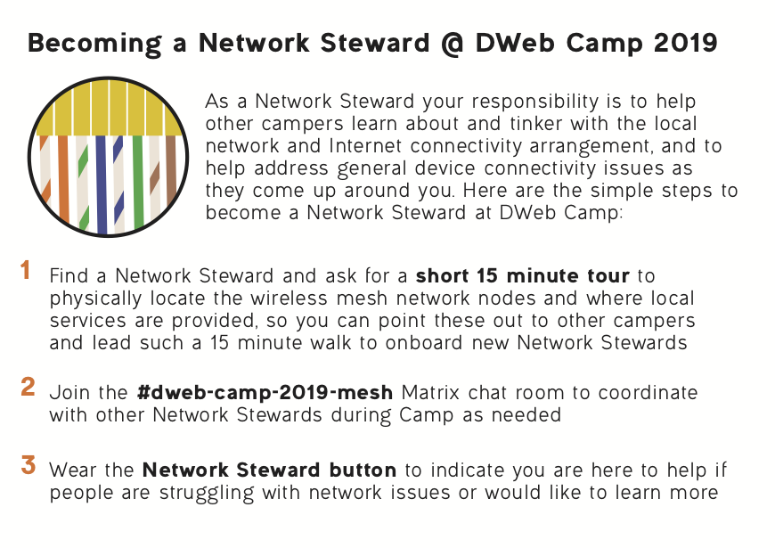

The first public announcement was made on June 14 via [GitHub](https://github.com/dweb-camp-2019/meshnet/issues/21), but by that time Benedict already had a group of about 10 volunteers who either had helped in the planning phases or indicated during registration that they would like to be a network volunteer. A few of the volunteers had a technical background in networking; most others had experience in building applications, facilitating workshops, and community organizing, but with little prior experience deploying physical networks.

### Build

The build of the network at Camp started in July, with Benedict and Margaret spending July 1-4 at the venue to run some cables and install the first nodes.

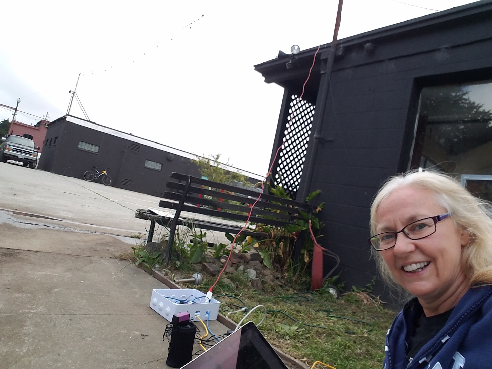

Since Margaret was the first person to learn how to set up a full node, which up until this point had been designed by Benedict and his remote peers, these couple of days at Camp also inspired how tasks can be shared by a team. This marked the beginning of the collaborative processes that would take place among Network Stewards leading up to and throughout Camp.

It was not until the second trip, when Benedict, Seth, lluna, and Robert spent July 7-10 at Camp that the core network nodes were installed. With the experience of partitioning tasks from the previous trip, this second trip was a highly productive time that started with planning on a map, then with each of the four Network Stewards putting together their custom node for the location they chose on the map.

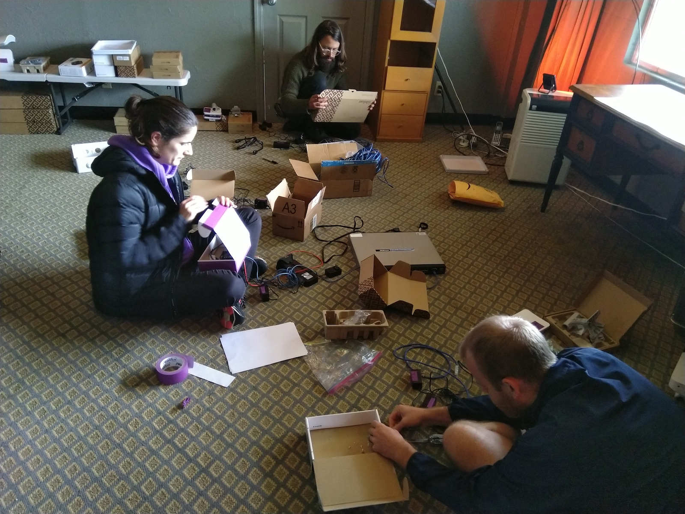

Putting together this first node together based on documentation, and struggling through technical hurdles together, made everyone generally familiar with all aspects of the system and knew who became the experts of specific domains. For example, everyone learned the available radios and how to test link bandwidth, but lluna became most familiar with preparing the ESPRESSObin routers (preparing SD cards for the different node configurations, [rescuing a dead board](https://github.com/dweb-camp-2019/projects/issues/36) with serial console, and keeping inventory of the different boards going around).

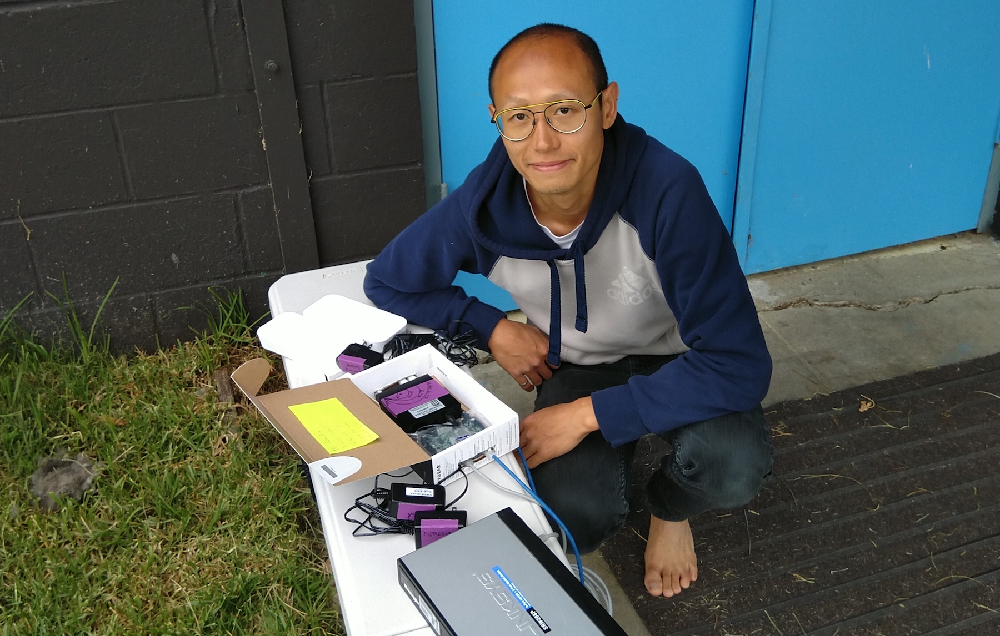

In a few short days, this early group of Network Stewards developed the team chemistry to parallelize tasks and the capacity to operate independently to screen and tackle network problems. We installed five of the six nodes during this period, leaving only `18 Camp Lions Mane` offline. Ben E. and Mai also popped by one of the days to wire up the indoor space of `8 Mesh Hall`, the main hacking and demo area with high speed wired networking for servers and other devices.

When the public Build Days, July 15-17, came along, much of the core network was already in place. The deployment work continued with the help of new Network Stewards, such as Luandro, Merlin, and Riley, who arrived to California just days before. Camp Lions Mane was quickly brought online and the Internet backhaul that just became available days ahead of Camp was plugged into the `10.5.0.1` mesh node at `5 Tea Lounge`.

Tasks at hand for the Network Stewards also diversified. Kyle, Alex, and Riley started configuring the central directory, `10.8.8.8`, which hosted [ip-dir](https://github.com/dweb-camp-2019/ip-dir) and [media uploader](https://github.com/darkrilin/dwebcamp-media-uploader). Meanwhile lluna, Jenny, Marcela, Taeyoon, Hiure, Lunadro, and Benedict started discussing activities on the mesh and how to on-board new Network Stewards. Most of these collaborations lasted beyond the Build Days and continued throughout Camp, adapting to the changing needs.

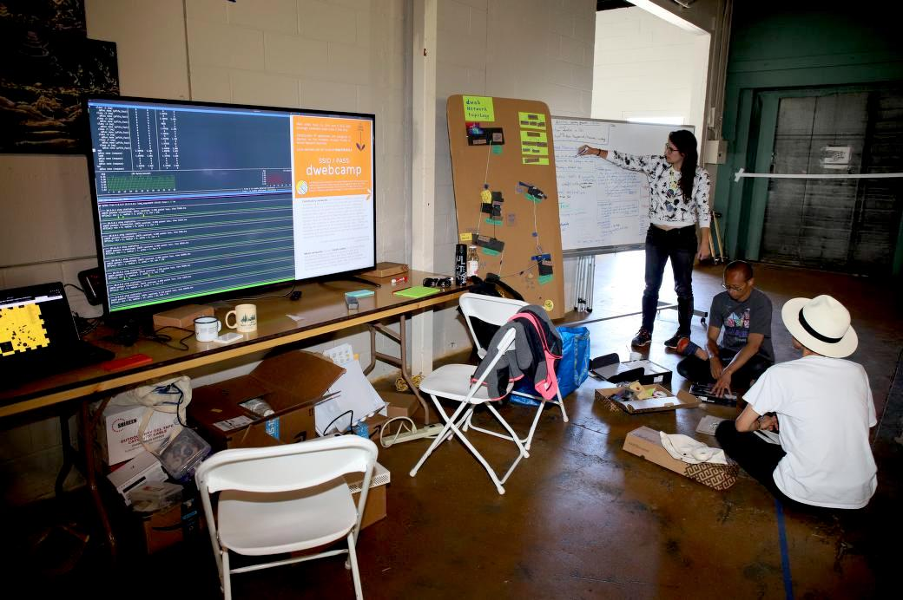

### Maintain

After the Build Days, the community of Network Stewards has grown to more than ten people, and about half of us took up specific domains of the many parallel initiatives. For example, we knew Seth, Luandro, and Ben E. were on top of keeping the overall network healthy, while a working group consisting of lluna, Jenny, Marcela, and Taeyoon independently built a network model for teaching the network.

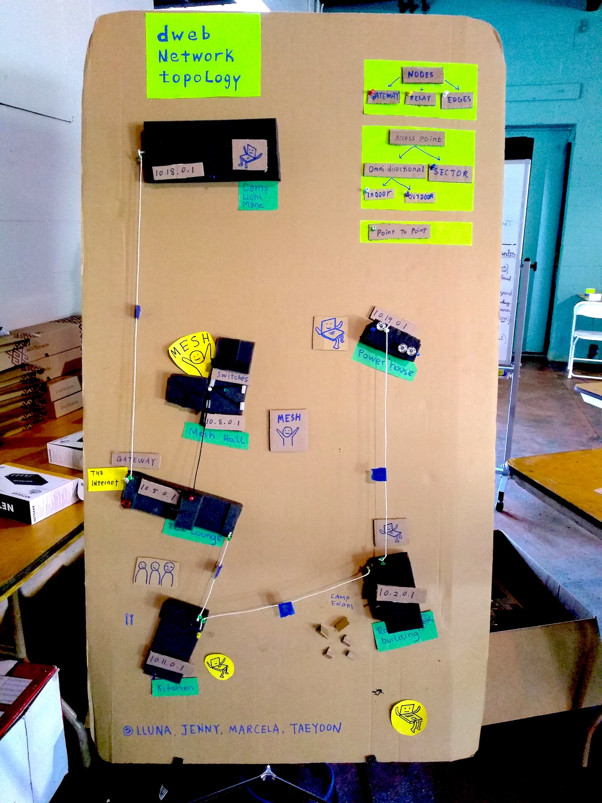

Kyle, Alex, and Riley helped application builders deploy their software and Raspberry Pis on the local network, keeping a collaborative IP address directory on `10.8.8.8`. The landing page of that Raspberry Pi evolved over time based on feedback of Camp participants. It was once a static page linking to various resources, and at some point it became a collaborative edit pad.

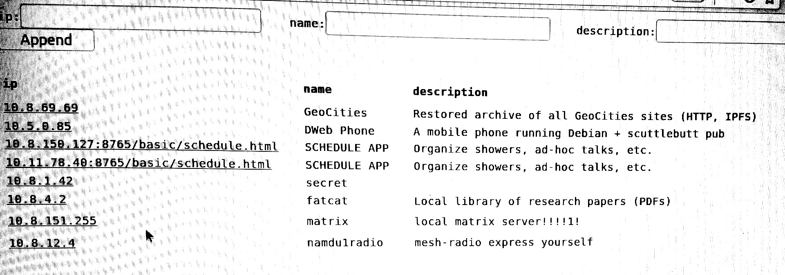

There were a couple interesting network incidences, some of them documented in [Section 3.3](3.3-incident-response.html).

### Teach

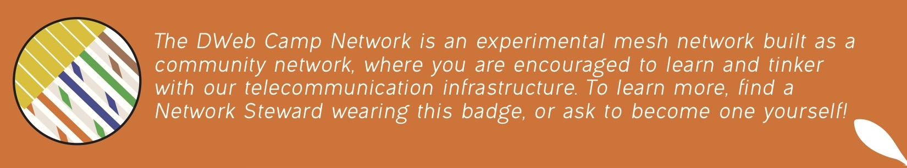

The Network Steward community was critical to our goal of a participatory network. We have taken steps to make the network infrastructure highly visible and communicated its development progress leading up to Camp, but many people arriving to Camp would come unaware of this experimental mesh network since event networks are generally provided as an opaque service managed by a closed group of network administrators. We would need many people with enough familiarity with the network to explain what it is, its design and function, the ways that one can tinker with it, and its relation to the culture of community networking.

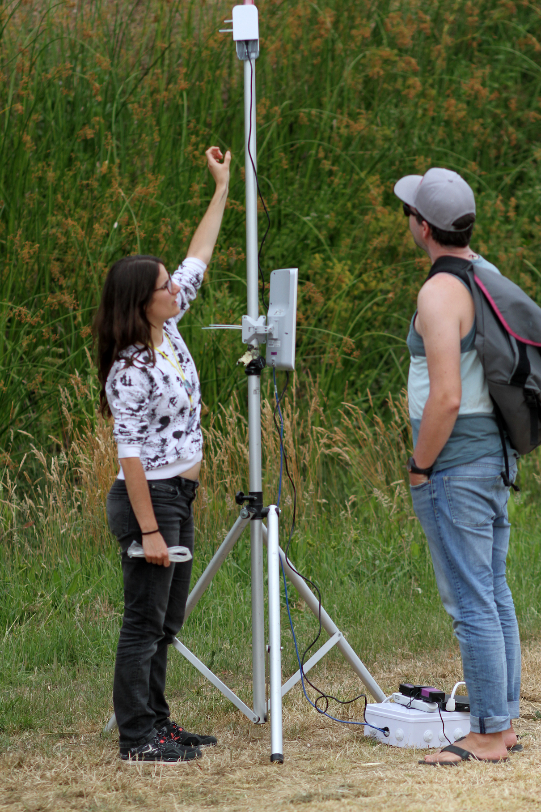

Organizing tours of the physical network infrastructure allowed for a visual experience, and having the network model aided the mental mapping of a single mesh link to the overall network topology. We also developed small cues such as linking IP addresses with the physical building numbers and the exercise of listing one's IP address on a phone or laptop, to relate one's digital experience to the physical infrastructure. We employed various network diagnostic programs that anyone can run on their phone or laptop, to help understand concepts such as _bandwidth_ and _routing_ when discussed independently from the Internet.

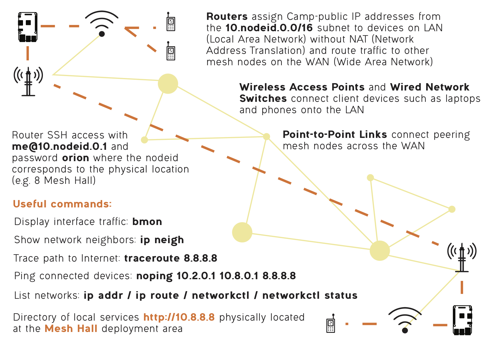

Diagrams and helpful commands were printed on a sheet by Ace ahead of Camp, intended for Network Stewards as reference, and anyone who took a tour was invited to become a Network Steward themselves and wear a pin to indicate to others that they could help explain the Camp network. This is a mechanism that would hopefully scale the Network Steward community nicely with the size of the event. You can find the graphic assets we used in [Section 5.3](5.3-graphic-assets.html).

In addition to running tours throughout the event, we also designed specific activities for those excited to dive deep into setting up their own mesh network.

Network Stewards facilitated the _Mesh Playground_ activity, where we explained components that make up a DWeb Camp 2019 node, constructed one together, and connected this new node to extend the Camp network as the seventh node. Then the group played around with network diagnostics and ethernet cable crimping competitions. A parallel initiative, the _Geek Free Meshnet_ led by Nico, Hiure, Luandro, and other community leaders of [APC](https://www.apc.org) demonstrated how to quickly set up a mesh network with the [LibreRouter](https://librerouter.org), informed by many years of rural networking experience and designed for plug-and-play deployment that requires no technical expertise.

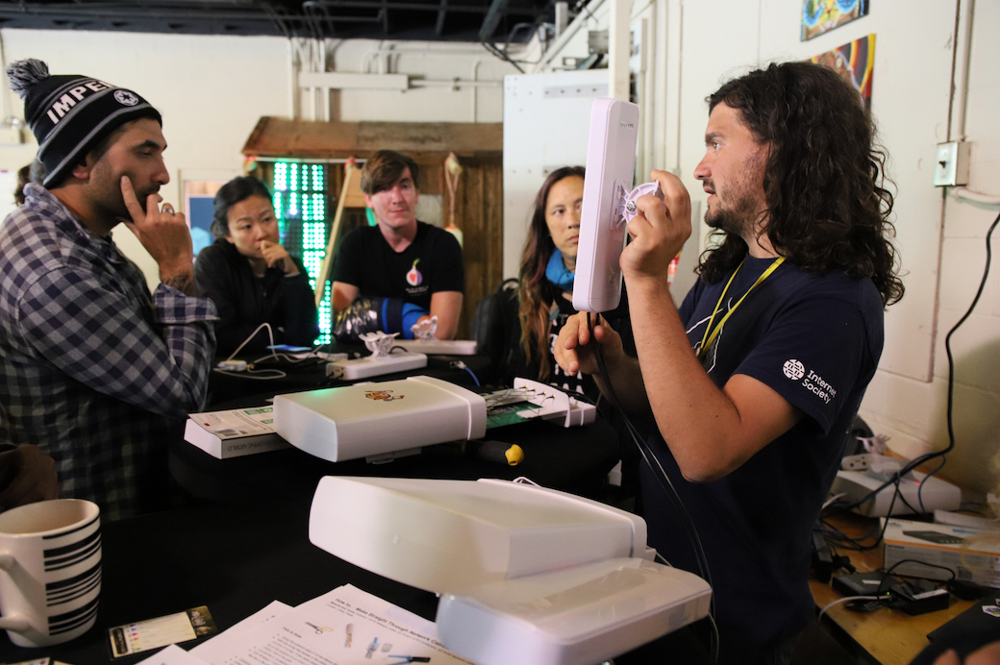

The Network Stewards program is perhaps the most important part of the participatory network. The network lasted only the couple days of Camp, but the shared experience around network building advanced individual technical capacities and trust among peers. Our learning from this program will be discussed in the [retrospective](3.5-retrospective.html) along with reflections about other components of the overall social experience.
