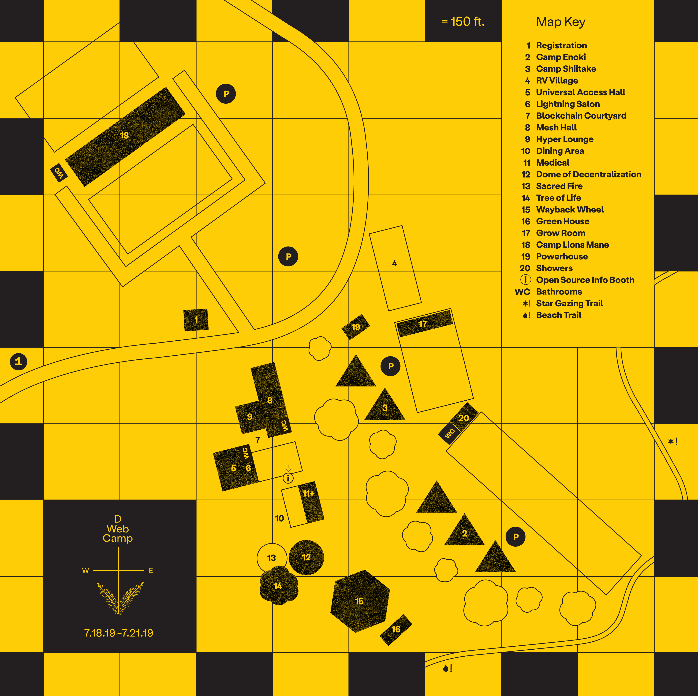
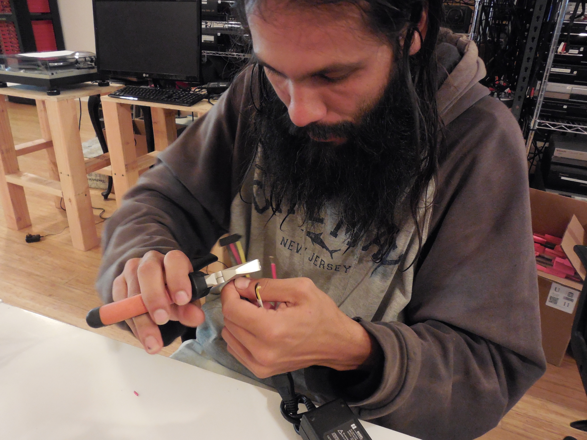
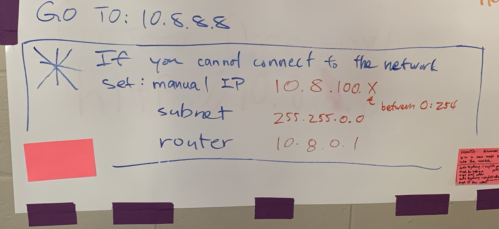
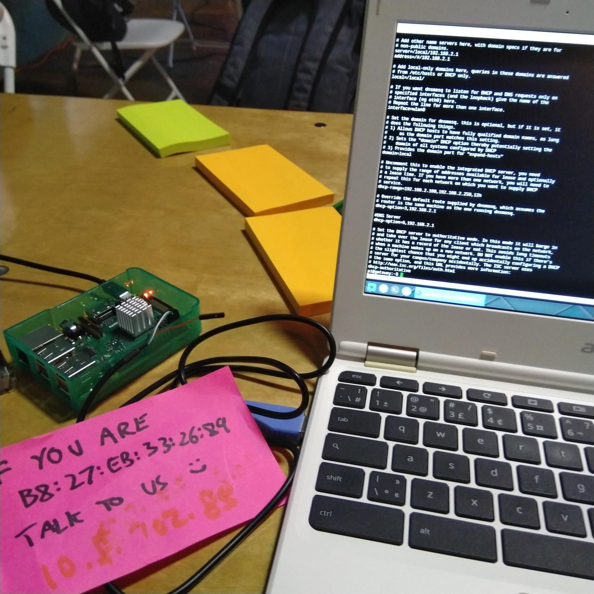

## 3.3 Incident Response

Although we discussed [many ways to monitor the health of the network](https://github.com/dweb-camp-2019/meshnet/issues/20), none of those were implemented due to capacity constraints. Our entire monitoring was basically [bmon](https://packages.debian.org/stretch/bmon) and [noping](https://manpages.debian.org/stretch/oping/noping.8.en.html) running on the `10.8.0.1` node at Mesh Hall displayed on a TV.

Here you can see terrible ping to `10.18.0.1`, which the building map tells us the path to `18 Camp Lions Mane` needs some servicing.

Upon discovering these network issues, Network Stewards can SSH access the nodes and run different diagnostics such as [iperf3](https://packages.debian.org/stretch/iperf3) to start debugging the problem.

We've encountered temporary outages from a stopped truck blocking an antenna, switch failure, access point saturation, and other small incidents. In all these cases, Network Stewards that happened to notice the problem had them resolved usually rather quickly and often enlisting the help of other curious campers.

Throughout the event, the network evolved organically. As people arrived, one of the nodes were saturated, and Seth added an extra access point radio in the night to handle the load. He also went with a group to swap out the Camp Lions Mane mesh link from a pair of 5 GHz SXTs to 60 GHz Wireless Wires. The registration desk was placed in an unanticipated location and the coverage was poor, so some Network Stewards convinced a kid from his VR headset to help rearrange the sector antennas on the `19 Powerhouse` solar node. It is important to emphasize that there was little central coordination of these initiatives to steward the network, and news of the network evolution mostly spread by word of mouth.

Now we will discuss a couple interesting incidents that the Network Stewards encountered.

### Gigabit Link Speed Drops To 100M

Here is the first report of the [issue](https://github.com/dweb-camp-2019/meshnet/issues/27):

>These are wireless wire links normally talking at 800 Mbps, passing thru Netgear gigabit managed switch for VLAN tagging, and into espressobin. Some of these links fall to 94 Mbps (100M) speeds all of a sudden and stay there. Tested with different cat5e cables. Suspect this is related to the Netgear switch. Rebooting it or entire node doesn't help. Same links have recorded 800+ Mbps.

Early debug confirmed that the radios were communicating at full speed, but eventually the ethernet interface dropped to 100M, and this happened in the absence of a VLAN tagging switch in between. The primary suspicion was excessive heating of the ESPRESSObin internal switch, because one end of the particular link experiencing this issue was exposed to direct sunlight, and Benedict had observed that link to operate at full speed during one night. So before returning to Camp, Luandro repurposed some unused computer fans we found at Internet Archive for 5V (quiet) and 12V (powerful) cooling.

Upon arriving at Camp, one group of Network Stewards went off to install our hacked fans onto nodes that were running under direct sunlight. This unfortunately did not fix the problem. Ben E from People's Open made it his personal mission to find out what was going on, and eventually narrowed it down to a poorly crimped ethernet cable. Of course :)

We have unfortunately ruled out the possibility of a faulty ethernet cable before because every cable had been checked with the ethernet tester, and we have swapped different cables for this node during early debug. In the end, this critical link between `2 Camp Enoki` and `11 Medical`, which we relied on to connect upper camp to the central areas, was returned to full gigabit speed.

### Rogue DHCP Server

`8 Mesh Hall` was the main area where project demos and other network-heavy activities were gathered. At one point, many people started losing Internet access from there even though their devices were connected to the access point. We, a group of Network Stewards, discovered that their devices were assigned an IP address that we did not expect, but... by who?

We discovered that these devices were indeed connected to our access point, not one that is broadcasting the same SSID and pretending to be the DWeb Camp network. This means we had a device connected to our network acting as a second DHCP server, and they were able to hand out IP addresses in their range faster our mesh node could. We identified the device's MAC address and started speculating on its intent, and it was potentially malicious because it was also running a DNS server, so it could redirect traffic to connected clients. We believed it was a wirelessly connected Raspberry Pi based on our information gathering, so it could be connected to a battery in a backpack and out of sight.

We tried to blacklist the MAC from the MikroTik radios, meanwhile leaving a message on the board asking people to set a static IP address on their device to avoid DHCP altogether. After spending many hours in the night, we thought we got the blacklist feature to work, but only to discover the device was connected again in the morning. This became a morning conversation for the people involved in the detective work, and when Dietrich heard about the incident, he thought of a suspicious Raspberry Pi.

It turned out there was a Raspberry Pi that had a Mozilla IoT WebThings Gateway image installed, and was passed off to Why for reconfiguring to connect to the wireless network, without realizing it was running a DHCP server 😭

Upon investigating, this IoT gateway not only had a DHCP server running on the wireless interface, but it was running with _dhcp-authoritative_ mode, which effectively overrides existing DHCP leases for clients! The device also disabled SSH on all interfaces and had no web UI, making it look especially like an intentionally malicious node 😅 We eventually discussed this interesting incident with Mozilla IoT and you can see the thread [here](https://github.com/mozilla-iot/gateway/issues/2038).

The takeaway is, we are glad we ran a routed network rather than a switch network, because otherwise this Raspberry Pi would have affected the entire network, not just the ones connected to the `10.8.0.1` node at Mesh Hall. We also need to figure out how to ban devices for the future.

### Standing Issues

[SD card corruption on poweroff without shutdown](https://github.com/dweb-camp-2019/meshnet/issues/28) is a common problem with single-board computers. Using a ramdisk system and minimizing SD card writes would help, but for the things we intend to do on the ESPRESSObin routers, we may need more RAM than available.

[Mesh links formed by wireless wires iperf3 asymmetric speeds](https://github.com/dweb-camp-2019/meshnet/issues/26) still remains a mystery.