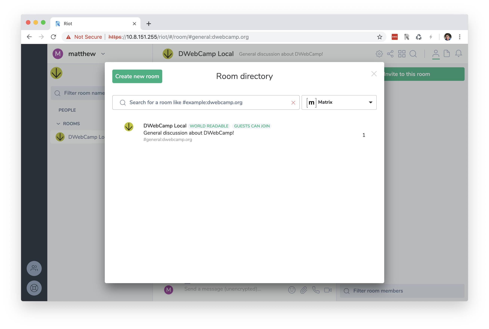
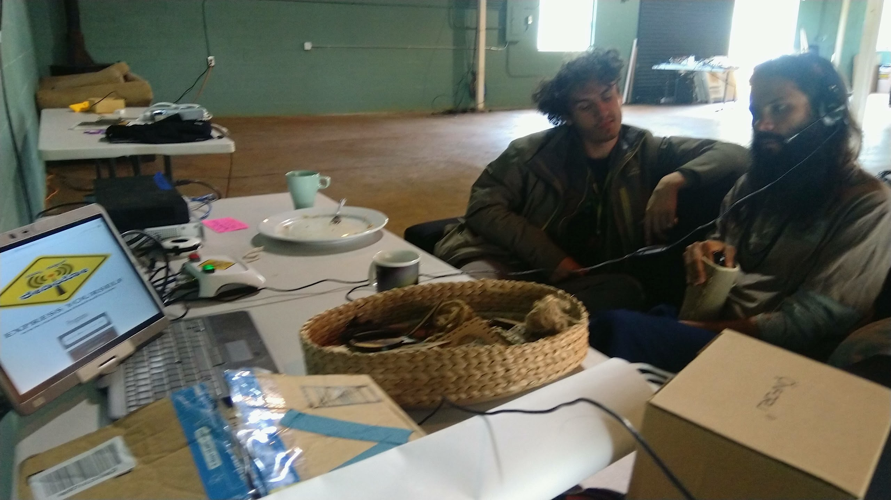
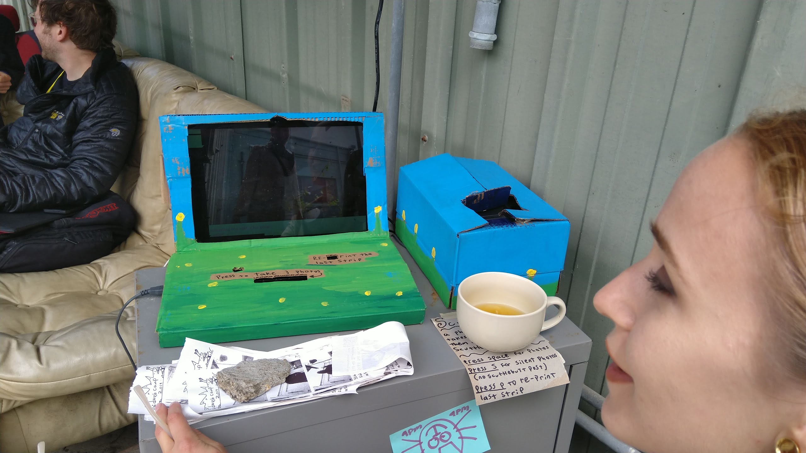

## 3.4 Local Services

The builders of DWeb Camp 2019 brought a number of local services to the network. Most of these were listed on the `10.8.8.8` Raspberry Pi plugged in at Mesh Hall, using a simple directory listing that Alex built days ahead of Camp.

[ip-dir](https://github.com/dweb-camp-2019/ip-dir) is a simple web app that allows builders to add an IP address, name, and description to a list. Everyone attending Camp, no matter which mesh node they are connected to, may navigate to `10.8.8.8` to view this list, and click one of IP addresses to access the service.

Kyle put up a full Geocities archive on [IPFS](https://ipfs.io) and Brian made available a giant repository of research papers on [fatcat!](https://fatcat.wiki) Mark, who tested his [GUN](https://github.com/amark/gun) app at the Internet Archive hackathon, installed Raspberry Pi bootstrap nodes at a couple mesh nodes to let people do [scheduling in real-time](https://github.com/dweb-camp-2019/projects/issues/2). Matthew brought a Raspberry Pi hosting a local [Matrix](https://matrix.org) homeserver.

Dinesh brought a audio-recording Raspberry Pi loaded with [Namma School Radio](https://www.namdu1radio.com) for us to record messages to the community.

There were some projects on the network that were either not added to the directory, or added after the photo was taken, or functioned completely peer-to-peer so it did not need any particular IP to be listed in a central directory for its function. For example, Scuttlebooth allowed people to take snapshots, posting them onto the [Scuttlebutt](http://scuttlebutt.nz) peer-to-peer social network that many people were running on their device during Camp.

[PLAN Systems](https://www.plan-systems.org) had a [demo](https://github.com/dweb-camp-2019/projects/issues/16) running at Mesh Hall, while Riley was hacking together a [media uploader](https://github.com/darkrilin/dwebcamp-media-uploader) that allowed people to upload photos onto a hard drive at Mesh Hall, and [LibreRouter](https://librerouter.org) together with a couple [DWeb Camp Global Fellows](https://medium.com/decentralized-web/https-medium-com-decentralized-web-introducing-2019-dweb-camp-global-fellows-1fafe29c3c9f) from [APC](https://www.apc.org) ran a parallel network altogether.

You can find out more about these projects, and many others, on [DWebCamp.org Projects](https://dwebcamp.org/projects/) and [GitHub](https://github.com/dweb-camp-2019/projects/issues?utf8=%E2%9C%93&q=is%3Aissue).