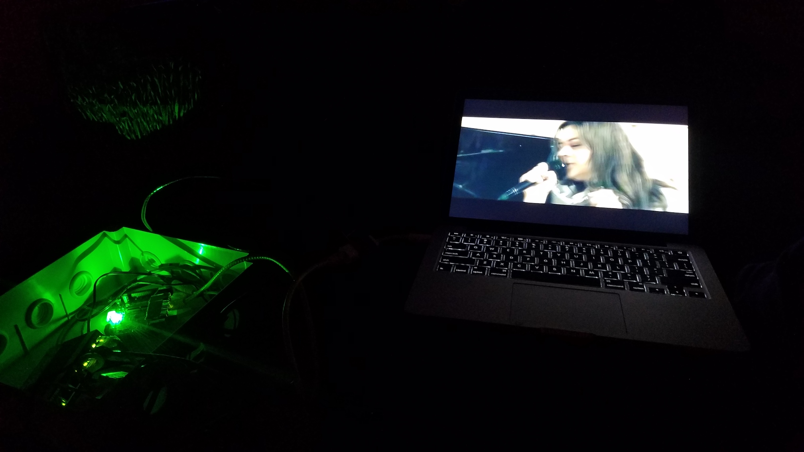

## 3.5 Retrospective

This documentation is drafted by Benedict, the Network Coordinator of DWeb Camp 2019, and may be biased towards his perspectives and subjective curation. However, everything on this website is open source and hosted as a static website from [GitHub](https://github.com/dweb-camp-2019/meshnet/), and everyone involved in this collective experience is invited to add their feedback and improve the content.

In the retrospective section, let us begin by sharing some documentation and post-event reflections by other Network Stewards. The first piece is a video documentation by Hiure, who traveled to Camp with Marcela and their baby Amina, both builders and organizers in their local community network in Brazil.

<iframe src="https://archive.org/embed/008511397" width="860" height="480" frameborder="0" webkitallowfullscreen="true" mozallowfullscreen="true" allowfullscreen></iframe>

You can see feedback from other [APC](https://www.apc.org) members [on the communitynetworks.group forum](https://communitynetworks.group/t/community-network-travel-fellowships/133/2). Many people also shared their DWeb Camp 2019 reflections on [Scuttlebutt](http://scuttlebutt.nz), and one of the posts by Taeyoon included an insightful prompt that felt especially relevant to discuss here:

>How to avoid centering of decentralization? How to decenter away from Silicon Valley, geographically, economically and culturally? What are the limits of decentralization? Perhaps decentralization is not the end goal, it may be the process? Then, what is the intention of our personal and collective practice? How to distribute and share the power to communicate, learn and build community?

This is a prompt to all of us as Network Stewards, as organizers and participants of DWeb Camp 2019, as builders and proponents of community networks and the decentralized web. After the significant investment that enabled this opportunity for technical tinkering and exchange, and with the relationships and trust we built among the community, we must ask ourselves _"what is the intention"_ and what did we learn about _"how to distribute and share the power to communicate, learn and build community?"_

The participatory network demonstrated a different way for humans to relate to digital technologies, where we emphasized the _participation_ over _consumption_ of technologies. We were learning together to build technologies to serve our needs, and in the process reinforced human-to-human trust through our collective struggles. Many of us stream videos on our phones and computers everyday, but the first video streamed over our local network felt like a monumental success. We imagined all the software and hardware we had put in place, as the bits moved to IP addresses via routed packets, through ESPRESSObins and wireless radios, reassembled by our computer to display this content with our familiar video playback controls. We were able to explain and ask questions about every step of the process and the physical infrastructure that enabled what we were experiencing on the screen.

In the early planning phases, we looked to events like [Chaos Communication Congress (CCC)](https://www.ccc.de/en/home) with a long history and admired their sophisticated networking operations, and wondered how the teams developed their collective capacity over many years. We hope our community of Network Stewards from DWeb Camp 2019 can be the seed that can will start this culture of network learning and building, where we can gather at events like DWeb Camp to tinker experimental networks, and bring these experiences to our local community projects or inspire new ones.

Through the Network Stewards program, we learned that when enthusiastic people are provided with the basic background and a support system, and entrusted to take ownership, we can enable spread knowledge to form a resilient collective that can lead parallel initiatives and tackle challenges that arise in a changing and complex system. Of course there were many unresolved issues in the network operations of 2019. We did not build sophisticated [monitoring and metrics](https://github.com/dweb-camp-2019/meshnet/issues/20) as CCC does, and there was no [local DNS](https://github.com/dweb-camp-2019/meshnet/issues/12) or [NTP](https://github.com/dweb-camp-2019/meshnet/issues/9) on site. The more centralized early planning phase led to many subjective design choices by the Network Coordinator, and most other Network Stewards had little opportunity to the network's overall design. Now with a high trust community of Network Stewards as foundation, we are in a better position to collectively tackle these technical and social challenges. Every issue, technical or otherwise, is an opportunity for our DWeb Camp Community Network to _"communicate, learn and build community"_.