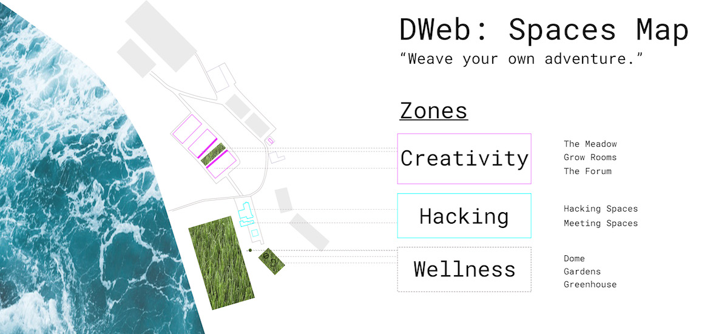
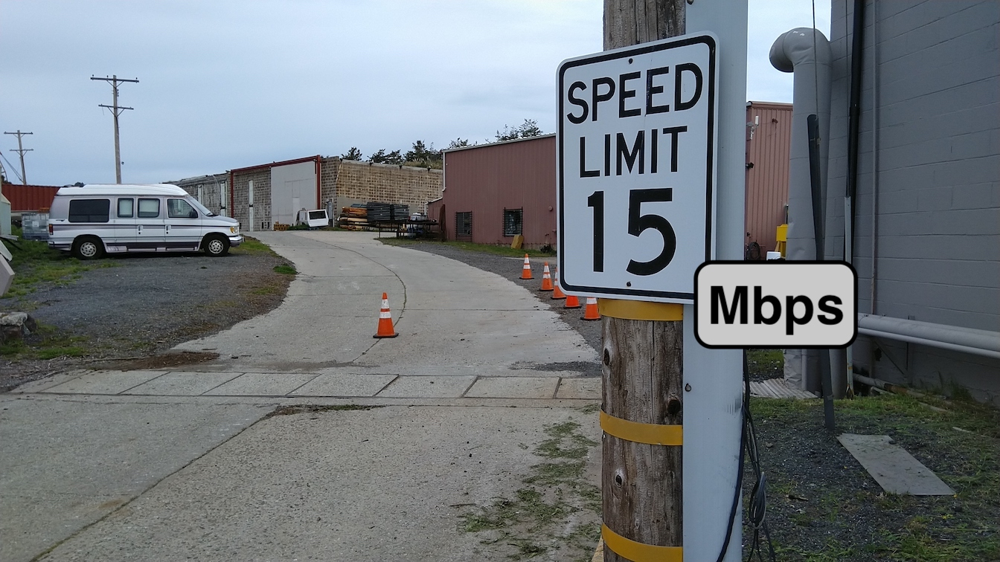
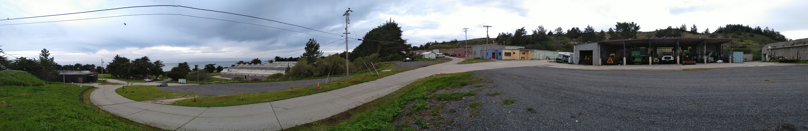
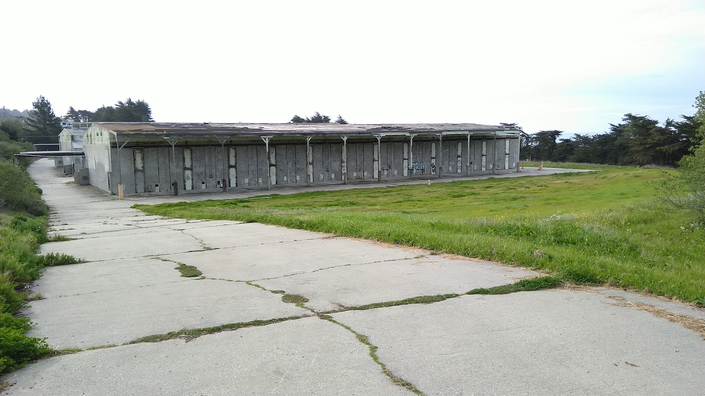
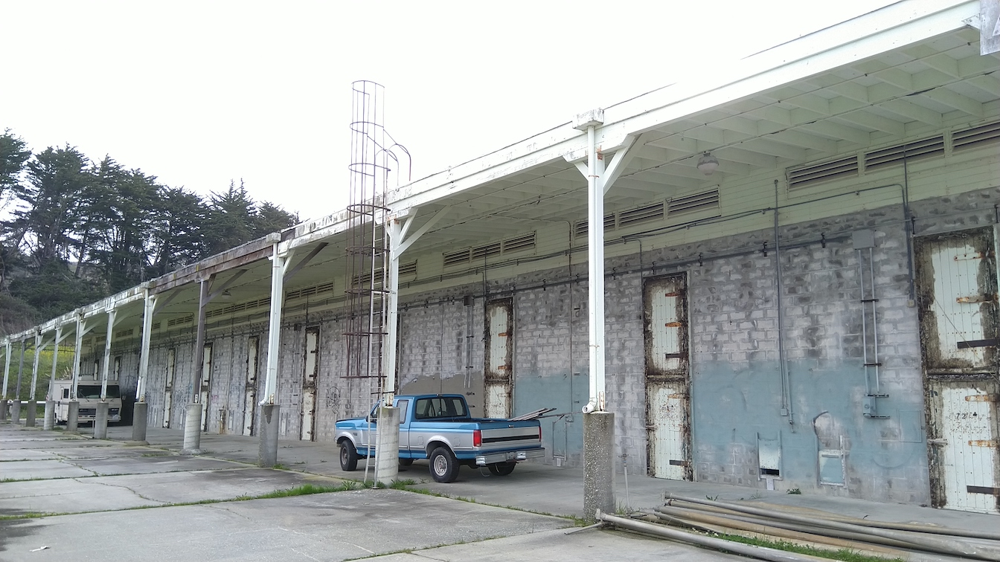
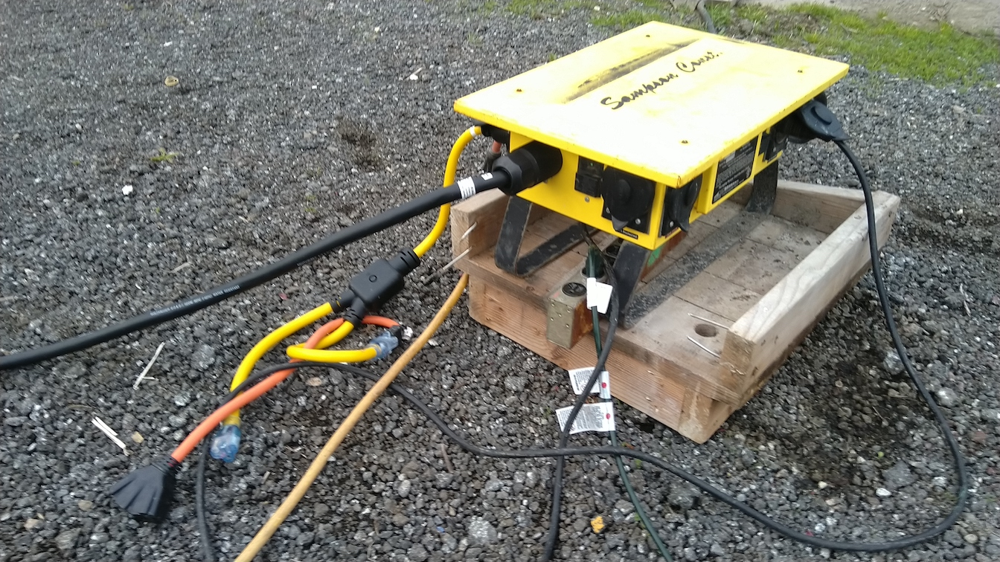

## 4.3 Site Survey

This is a summary of notes from my visit to The Farm that is relevant to the planning of the local mesh network, and some follow-up discussions with various people that happened over April.

Upon arriving to The Farm on March 31, the first thing I realized was how huge the area is, and that the Camp will stay mostly near the areas around the buildings. We may have to connect to one point further away from the buildings to get Internet access (more on that later), but we should prioritize getting the main indoor and outdoor spaces reliable local network access for devices of 500 people, and not worry too much about connectivity in areas far from the buildings.

### Existing Network & Internet Access

Let's start with what connectivity currently exists at The Farm based on a [rough map of the zones we defined for the Camp](https://dwebcamp.org/proposals-spaces/).

The _Hacking Zone_ is the most well connected space, where staff offices and indoor facilities like the _Tea Lounge_ currently exist. Inside these buildings, one can connect to the _Indoor AP_ SSID made available with Ubiquiti APs wired to a switch in one of the offices. Beyond this cluster of buildings, one can connect to the _Outdoor AP_ which is wirelessly connected in a mesh topology using the omnidirectional [Ubiquiti UniFi Mesh devices](https://unifi-mesh.ui.com). The Internet access speeds are similar but outdoor coverage is more spotty, and having 500 people would likely overwhelm the sparsely distributed outdoor devices and the existing Internet backhaul.

The existing Internet access is beamed across the ocean from Monterey more than 50 km away. It can theoretically reach up to 40 Mbps, but in the two days I was there it measured something like 5 Mbps download and 12 Mbps upload, and was down one of the mornings. Phone connectivity to cellular service is extremely poor, most people have zero service while some people have spotty coverage.

### On-going Work for Internet Access

While we have been planning for _a 500+ Mbps local network with no Internet access at all_, there is a parallel effort led by Jonah to source Internet access to the Camp. We have discussed ideas like having different types of connectivities, and segmenting them into different SSIDs so Camp participants can experiment with them.

| Connection type             | Speed (Mbps) | Status |
|:----------------------------|:-------------|:-------|
| Fiber (dark or new)         | 1000         | Not feasible due to cost and lead time |
| Wired from large ISP        | 100 - 1000   | Require build-out and contract, not feasible due to cost and lead time |
| Local wireless ISPs         | 20 - 100     | Currently evaluating locations for new relay tower (this is where we may have a solar-powered node acting as relay to main meshnet cluster) |
| Existing long-distance link | 40           | Investigating whether provider can improve bandwidth and reliability |
| Satellite                   | 30           | Potentially as emergency link but cost structure (max bytes) infeasible for general use |
| Cellular                    | ?            | Potentially emergency or general use, using range extenders with a 4G provider that has service in the area |

None of these options is confirmed at the time of writing due to service availability and cost considerations. If some of these play out, they will likely be late additions that we'd confirm closer to July and it is entirely possible that none of these options will be available!

### Local Network Prototyping

These MicroTik devices came in the week I was at the Internet Archive so I was able to pick up these for prototyping, along with a pair of ESPRESSObin and a PoE switch I borrowed from Yurko at Toronto Mesh.

I also reached out to LibreRouter and SolidRun, but they don't fit very well with our event timelines. I am hoping to run Babel on the ESPRESSObin single-board computers that would connect to the MicroTik radio equipment.

### Local Network Installation Plan

The plan for putting together this network looks something like this.

| Date      | Milestone                                                                              |
|:----------|:---------------------------------------------------------------------------------------|
| Jun 8     | Communication infrastructure test at _The Farm_                                        |
| Jun ?     | Meetup @ Internet Archive with a few nodes for application developers to do a test run |
| Jul 1     | Power infrastructure in place                                                          |
| Jul 8     | Meshnet core nodes and Internet connectivity in place                                  |
| Jul 15-17 | Volunteer build-out of structures and meshnet                                          |
| Jul 21-22 | Volunteer camp take-down                                                               |
| Jul 18-21 | **DWeb Camp**                                                                          |

In the following photo, you can see telephone poles that we can access with a lift. The plan is that we will book a lift around the July 8 date and install the first few nodes of the local network with a small group of volunteers that have experience setting up networks.

Then between July 15-17, we can involve more volunteers to connect areas such as this camp ground to the right of the large buildings in this photo.

In indoor spaces at the _Hacking Zone_, we can use the existing access points that serve the _Indoor AP_ for wireless client connectivity, and add ethernet drops wired to the network switch at the mesh node at the building, where we expect groups gather and hack on projects. Raspberry Pis can be wired in from there to provide main services throughout the Camp, such as local Internet Archive content and a Matrix homeserver.

There are also interesting outdoor spaces like this ladder, where we can hang WiFi radios that are easy to access, and perhaps put a switch underneath for people to plug devices into, and see them federate with those devices plugged in at the indoor space.

### Power Availability

In our large outdoor areas, we'll need to consider power for anything to work at all. While I was at The Farm, I saw power cables runs throughout main areas.

Joshua assured me that wired power would not be a problem in the spaces we plan to use for the Camp. Additionally, there are ongoing solar power projects at The Farm, and for the power needs of WiFi equipment, their solar-charged batteries can easily power mesh nodes with multiple radios if necessary. So even when it is unfeasible to run cables (e.g. the more remote relay tower for Internet backhaul), we can have a standalone solar-powered node.

### Mesh Network Software

There were various discussions relating to what mesh software to run. The simplest is to run a big switch network, which is like a typical home network, just with more devices plugged in. This is simplest, and we shouldn't run into scalability issues at our size. In large switch networks, broadcast traffic becomes significant, eating up precious wireless bandwidth and it is easy for individual clients to ruin it for everyone (e.g. having multiple DHCP servers). On the other hand, peer-to-peer applications that support local network peering (e.g. via broadcasts) will work beautifully. For example, you will see all Secure Scuttlebutt (SSB) clients on the local network without the need for _Pubs_. Although some community networks are indeed run as switch networks, this kind of feels like cheating in terms of testing our peer-to-peer applications, because this is generally not the type of networks we find in the real world. Most real world networks are networks of switch networks, having Layer 3 boundaries that broadcast messages do not pass through naturally, thus requiring bootstrap servers with public addresses a lot of times. So we intend to run a similar type of network using Babel, a Layer 3 mesh protocol, which present some of the challenges of real world networks (e.g. the Internet).

### Extras

In discussions with Jonah, we came up with some cool ideas, some of which Jonah had positive experience from his previous events:

**A pair of Wireless Wire**: This is a pair of wireless radios preconfigured to talk to each other. It forms a point-to-point network without need for configuration.

**AP box (without client isolation)**: This is simply a home Access Point that allow clients to broadcast messages, so peer-to-peer apps can easily discover other devices that joined the same SSID. Client devices (e.g. laptops and phones) can join wirelessly or plug into ethernet ports, and the device is battery powered, so we can take it anywhere to become a hub for a little local network.

These are not very different from the nodes in the larger mesh network, but they are fun devices for groups to sign them out and use them in their project, or just tinker with them in an isolated environment.