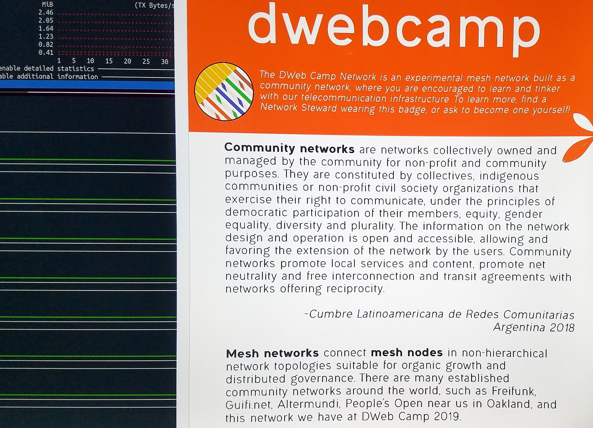
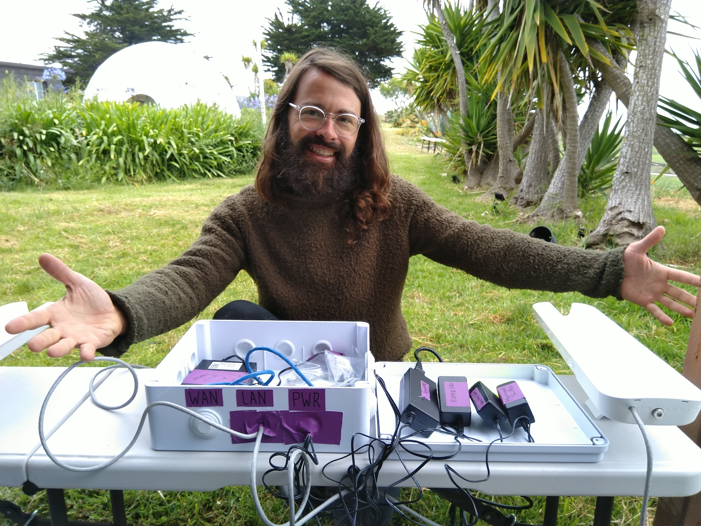

# Meshnet 📡 DWeb Camp 2019

This website documents the design, build, and stewardship of the participatory network at [DWeb Camp 2019](http://dwebcamp.org).

## 1.0 Project Overview

### Design Goals

The idea of a participatory meshnet project came about when the organizers of DWeb Camp started imagining the summer event for 2019. shortly after, we put this up on a GitHub README:

>The 2019 Decentralized Web ~~Summit~~ Camp will take place at a beautiful piece of coastal land an hour west of San Jose from July 18 to 21.
This area currently has very minimal network infrastructure and Internet connectivity.
Let's use this opportunity to build, test, and use our decentralized systems together,
in a connectivity environment that more closely resembles large parts of the world,
and co-imagine the social processes and local technologies that will help us organize day-to-day,
and make inclusive spaces to learn from each other and build capacity around human-empowering technologies.

We decided to build an experimental network for an experimental event at a new venue that is itself undergoing its own experiment, but we also knew our 500 expected participants is exactly the right crowd to experiment with together, so we drafted the following design goals:

- Reliable local network with 802.11ac speeds
- Access points in key areas for client devices (e.g. phones and laptops) to connect
- Allow Camp participants to extend or run locally-hosted services on the network
- Carry traffic to Internet gateway for client devices to access the Internet with limited bandwidth and reliability
- Document setup and learnings for future events or other groups

Then the meshnet project for DWeb Camp 2019 became official, and Benedict Lau, as Network Coordinator, started designing this network on [dweb-camp-2019/meshnet](https://github.com/dweb-camp-2019/meshnet/), while Jonah Edwards, as Connectivity Coordinator, started sourcing an Internet backhaul to the event venue. At the same time, we invited anyone who was interested in contributing to the planning to join us at [#dweb-camp-2019-mesh:matrix.org](https://riot.im/app/#/room/#dweb-camp-2019-mesh:matrix.org).

### Participatory Network

The idea of a participatory network may seem foreign, but not for those who have participated in a Community Network (CN). Essentially what we were hoping to accomplish is to borrow from established CNs not only their software and hardware experiences, but also the social processes of co-creating and co-maintaining network infrastructure, and create our temporary CN with the participants of DWeb Camp 2019.

### Documentation Outline

The technical design of the mesh network is documented in [Section 2](2.0-network-design.html), and [Section 3](3.0-social-experience.html) summarizes the social aspect of this project and the learnings that came out of running this participatory network together. [Section 4](4.0-planning-notes.html) contains early planning notes and [Section 5](5.0-additional-resources.html) has additional resources and a [Photo Gallery](gallery/2019/) of the network design and build.

We hope this documentation will serve as a reference and inspire future instances of participatory networks at events and communities.
If you have feedback or would like to learn more about this project, please email [hello [at] hypha.coop](mailto:hello@hypha.coop) to get in touch!

### Licenses

The source code in the [GitHub repository](https://github.com/dweb-camp-2019/meshnet/) is licensed under [GNU General Public License version 3 (GPL-3.0)](https://github.com/dweb-camp-2019/meshnet/tree/master/licenses/LICENSE-GPL-3.0).

Content on this website is licensed under [Attribution-ShareAlike 4.0 International (CC BY-SA 4.0)](https://github.com/dweb-camp-2019/meshnet/tree/master/licenses/LICENSE-CC-BY-SA-4.0), with the exception of the [5.4 Photo Gallery](gallery/2019/) that features photos from multiple photographers.

The website is generated using [Jekyll](https://jekyllrb.com) and [ImageMagick](https://imagemagick.org), and contains modified versions of source code from the Jekyll theme [alexander-heimbuch/millidocs](https://github.com/alexander-heimbuch/millidocs) licensed under [The MIT License (MIT)](https://github.com/dweb-camp-2019/meshnet/tree/master/licenses/LICENSE-MIT) and [ggreer/jekyll-gallery-generator](https://github.com/ggreer/jekyll-gallery-generator) licensed under [Apache 2.0](https://github.com/dweb-camp-2019/meshnet/tree/master/licenses/LICENSE-Apache-2.0).
